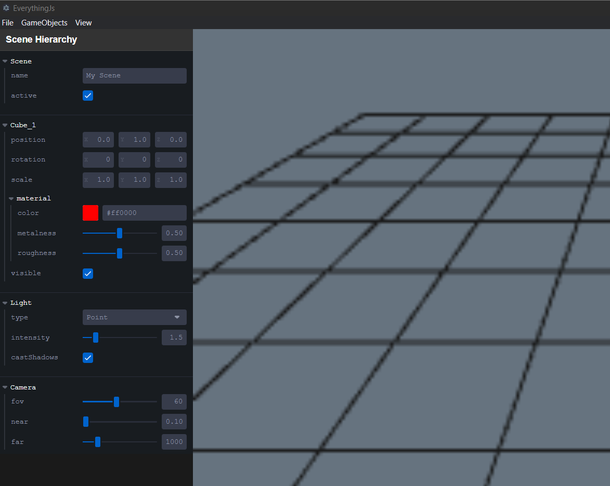

# EverythingJs

[](https://opensource.org/licenses/MIT)
[](https://playcanvas.com)
[](https://www.electronjs.org/)

A modern, cross-platform game engine built on PlayCanvas and Electron. EverythingJs provides a powerful yet intuitive environment for game development with a visual editor and cross-platform publishing capabilities.



## Features

- **PlayCanvas Integration**: Leverages the powerful PlayCanvas WebGL engine
- **Cross-Platform**: Build and deploy games across multiple platforms
- **Visual Editor**: User-friendly scene editor with hierarchical entity management
- **Real-Time Preview**: Instantly see your changes as you create
- **Asset Management**: Simplified importing and organization of game assets
- **Component-Based Architecture**: Flexible entity-component system
- **Scene Management**: Save, load, and organize your game scenes
- **Modern UI**: Built with React for a responsive editing experience
- **Property Controls**: Intuitive parameter tweaking with Leva UI controls

## Installation

```bash
# Clone the repository
git clone https://github.com/yourusername/EverythingJs.git

# Navigate to the project directory
cd EverythingJs

# Install dependencies
npm install

# Start the development environment
npm run dev
```

## Development

```bash
# Build for production
npm run build

# Run the application
npm start
```

## Project Structure

- `src/engine`: Core engine functionality and editor components
- `src/main`: Electron main process code
- `src/engine/editor`: Visual editor implementation
- `src/engine/components`: React UI components
- `src/engine/services`: Core services for file management, etc.

## Publishing Your Games

EverythingJs allows you to publish your games to multiple platforms:
- Web (HTML5)
- Desktop (Windows, macOS, Linux)
- Mobile (via compatible wrappers)

## Contributing

Contributions are welcome! Please feel free to submit a Pull Request.

1. Fork the project
2. Create your feature branch (`git checkout -b feature/amazing-feature`)
3. Commit your changes (`git commit -m 'Add some amazing feature'`)
4. Push to the branch (`git push origin feature/amazing-feature`)
5. Open a Pull Request

## License

This project is licensed under the MIT License - see the LICENSE file for details.

## Acknowledgments

- [PlayCanvas](https://playcanvas.com/) - WebGL game engine
- [Electron](https://www.electronjs.org/) - Cross-platform desktop apps with JavaScript
- [React](https://reactjs.org/) - UI library
- [Leva](https://github.com/pmndrs/leva) - React-based GUI controls for parameters 